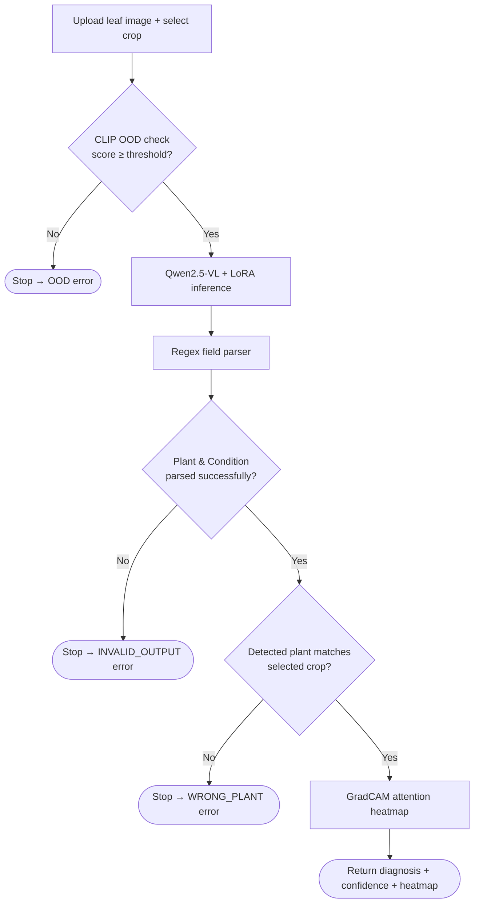

# 🌿 PlantMed AI — Vision-Language Crop Disease Diagnosis


A modular, production-style plant disease diagnosis system built on **Qwen2.5-VL-7B-Instruct** (fine-tuned with LoRA) and **CLIP ViT-B/32**. Upload a leaf photo, pick a crop, and get a structured diagnosis with a confidence score and a GradCAM-style attention heatmap explaining what the model looked at.

Runs on Windows, macOS, and Linux — the device (CUDA / Apple Silicon / CPU) and every model path are auto-detected or configured via environment variables, no source edits required.

---

## Contents

- [Features](#features)
- [How it works](#how-it-works)
- [Project structure](#project-structure)
- [Requirements](#requirements)
- [Quick start](#quick-start)
- [Configuration](#configuration)
- [Using the app](#using-the-app)
- [Output format](#output-format)
- [Troubleshooting](#troubleshooting)
- [Extending to new crops](#extending-to-new-crops)
- [Disclaimer](#disclaimer)
- [Acknowledgments](#acknowledgments)

---

## Features

- **Vision-language diagnosis** — a LoRA-fine-tuned Qwen2.5-VL-7B-Instruct generates a structured diagnosis (plant, condition, severity, pathogen, symptoms, explanation) directly from the leaf image.
- **Out-of-distribution filtering** — a multi-prompt CLIP similarity check rejects non-leaf images before they ever reach the VLM.
- **Crop-mismatch validation** — flags cases where the detected plant doesn't match the crop you selected, instead of silently returning a wrong diagnosis.
- **Explainability** — a GradCAM-style attention heatmap shows which regions of the leaf the model focused on.
- **Structured, parseable output** — every response is a clean dictionary (see [Output format](#output-format)), easy to log or feed into other systems.
- **Cross-platform by default** — automatically selects CUDA, Apple Silicon (MPS), or CPU, and every tunable value can be overridden with an environment variable.

## How it works



Each stage is a hard gate: an image that fails the OOD check or a crop mismatch never reaches later, more expensive stages.

## Project structure

```
Crop_Disease_VLM/
├── app.py                  # Streamlit frontend
├── config.py                # All settings — env-var overridable, see .env.example
├── pipeline.py               # run_pipeline() — single entry point for a diagnosis
├── check_setup.py             # Environment / config sanity check (run before streamlit)
├── requirements.txt
├── .env.example               # Copy to .env and fill in your paths
├── models/
│   ├── __init__.py
│   └── loader.py              # load_vlm() and load_clip()
└── utils/
    ├── __init__.py
    ├── ood.py                  # CLIP-based out-of-distribution detection
    ├── inference.py             # Qwen2.5-VL generation
    ├── parser.py                # Regex field extractor
    ├── validator.py             # Plant-mismatch check
    └── gradcam.py                # Attention heatmap explainability
```

## Requirements

**Hardware**
- A CUDA GPU is strongly recommended. Qwen2.5-VL-7B in bfloat16 needs roughly 16 GB+ VRAM for inference, more with beam search — 24 GB (RTX 3090 / 4090 / A5000) is comfortable at the default settings.
- Apple Silicon (M-series) works via MPS but is noticeably slower.
- CPU-only works but is very slow for a 7B model — expect minutes per image. Lower `VLM_NUM_BEAMS` if you're stuck on CPU.

**Software**
- Python 3.10 (tested; 3.9+ likely works)
- ~15 GB free disk for model weights (base Qwen2.5-VL-7B + CLIP), downloaded automatically from Hugging Face on first run
- Your own fine-tuned LoRA adapter — trained separately and **not included in this repo** (the checkpoint is too large for git; see [Configuration](#configuration))

## Quick start

**1. Clone the repository**

```bash
git clone https://github.com/kharulkamaaksha/Crop_Disease_VLM.git
cd Crop_Disease_VLM
```

**2. Create and activate a virtual environment**

macOS / Linux:
```bash
python3 -m venv venv
source venv/bin/activate
```

Windows (PowerShell):
```powershell
python -m venv venv
.\venv\Scripts\Activate.ps1
```

**3. Install dependencies**

```bash
pip install -r requirements.txt
```

**4. Point the app at your model weights**

```bash
cp .env.example .env
```

Open `.env` and set `VLM_ADAPTER_PATH` to the folder containing your fine-tuned LoRA checkpoint. The base Qwen2.5-VL and CLIP models are downloaded automatically from Hugging Face the first time you run the app.

**5. Verify your setup**

```bash
python check_setup.py
```

This checks your Python version, installed packages, detected device (CUDA / MPS / CPU), and whether your adapter path resolves — with clear pass/fail output instead of a Streamlit stack trace.

**6. Run the app**

```bash
streamlit run app.py
```

Streamlit will open the UI in your browser (usually `http://localhost:8501`).

## Configuration

Everything in `config.py` can be overridden by an environment variable — either exported in your shell or set in a local `.env` file (see `.env.example`). Environment variables always take precedence over the defaults.

| Variable | Default | Description |
|---|---|---|
| `VLM_ADAPTER_PATH` | `./checkpoints/qwen25vl_plantvillage_best` | Path to your fine-tuned LoRA adapter |
| `VLM_BASE_MODEL_PATH` | `Qwen/Qwen2.5-VL-7B-Instruct` | Base VLM — Hugging Face ID or local path |
| `VLM_CLIP_MODEL_PATH` | `openai/clip-vit-base-patch32` | CLIP model used for OOD detection |
| `VLM_DEVICE` | `auto` | `auto`, `cuda`, `mps`, or `cpu` |
| `VLM_OOD_THRESHOLD` | `0.27` | Minimum CLIP similarity to pass the leaf check |
| `VLM_MAX_NEW_TOKENS` | `200` | Max tokens generated per diagnosis |
| `VLM_NUM_BEAMS` | `4` | Beam search width (lower = faster, less VRAM) |
| `VLM_REPETITION_PENALTY` | `2.5` | Discourages repeated phrases in the output |
| `VLM_NO_REPEAT_NGRAM_SIZE` | `6` | Blocks repeated n-grams of this size |
| `VLM_CONFIDENCE_OFFSET` | `0.30` | Shifts the OOD similarity into a display-friendly confidence score |
| `VLM_LOG_LEVEL` | `INFO` | `DEBUG`, `INFO`, `WARNING`, or `ERROR` |

The list of supported crops (`SUPPORTED_PLANTS`) and the instruction prompt sent to the VLM are also in `config.py` if you need to change them directly.

## Using the app

1. **Select a crop** from the dropdown (Tomato, Potato, or Pepper by default).
2. **Upload a leaf image** (JPG or PNG).
3. The pipeline runs automatically: OOD check → VLM diagnosis → field parsing → crop validation.
4. On success, you'll see a confidence score, severity badge, the full structured diagnosis, and a GradCAM attention heatmap. The raw model output is available in the "Raw model output" expander at the bottom.
5. If the image isn't recognized as a leaf, or the detected plant doesn't match your selection, the app shows a clear error instead of a diagnosis.

## Output format

**Success:**
```json
{
  "status": "success",
  "data": {
    "Plant": "Tomato",
    "Condition": "Late Blight",
    "Severity": "Moderate to Severe",
    "Pathogen": null
  },
  "raw": "Plant: Tomato. Condition: Late Blight. ...",
  "confidence": 0.61
}
```

**OOD error** (image not recognized as a plant leaf):
```json
{
  "status": "error",
  "type": "OOD",
  "message": "Image not recognised as a plant leaf. Please upload a valid leaf photo.",
  "score": 0.19
}
```

**Plant mismatch:**
```json
{
  "status": "error",
  "type": "WRONG_PLANT",
  "expected": "Tomato",
  "detected": "Potato"
}
```

**Invalid model output** (VLM failed to produce required fields):
```json
{
  "status": "error",
  "type": "INVALID_OUTPUT",
  "message": "Model failed to generate a valid diagnosis. Missing required fields: Plant, Condition. Try re-uploading a clearer image."
}
```

## Troubleshooting

| Problem | Fix |
|---|---|
| `FileNotFoundError: LoRA adapter not found` | Set `VLM_ADAPTER_PATH` in `.env` to your checkpoint's folder, then rerun `python check_setup.py`. |
| `ImportError` on startup | Activate your venv and run `pip install -r requirements.txt` again; `check_setup.py` will tell you exactly what's missing. |
| CUDA out of memory | Lower `VLM_NUM_BEAMS` (e.g. to 1–2) and/or `VLM_MAX_NEW_TOKENS` in `.env`, or run on a GPU with more VRAM. |
| First run is very slow | The base Qwen2.5-VL-7B and CLIP weights (~15 GB) download from Hugging Face the first time — subsequent runs use the local cache. |
| Extremely slow on CPU / Apple Silicon | Expected for a 7B model without a CUDA GPU. Lower `VLM_NUM_BEAMS` and `VLM_MAX_NEW_TOKENS` to reduce latency. |
| GradCAM panel says "unavailable" | The model didn't expose attention weights for that forward pass; the diagnosis itself is unaffected. |

## Extending to new crops

1. Add the new crop name to `SUPPORTED_PLANTS` in `config.py`.
2. Train a new LoRA adapter that covers the crop and point `VLM_ADAPTER_PATH` at it (or maintain separate per-crop adapters and swap the path).
3. The rest of the pipeline — OOD check, parsing, validation, GradCAM — works unmodified.

## Disclaimer

This is a research/educational tool. Diagnoses are generated by a fine-tuned language model and are **not a substitute for a professional agronomist**, especially before making treatment or pesticide decisions.

## Acknowledgments

- [Qwen2.5-VL](https://github.com/QwenLM/Qwen2.5-VL) (Alibaba) — base vision-language model
- [CLIP](https://github.com/openai/CLIP) (OpenAI) — out-of-distribution detection
- [PlantVillage](https://plantvillage.psu.edu/) — dataset used for fine-tuning
- [Hugging Face Transformers](https://github.com/huggingface/transformers) & [PEFT](https://github.com/huggingface/peft)
- [Streamlit](https://streamlit.io/) — app framework
